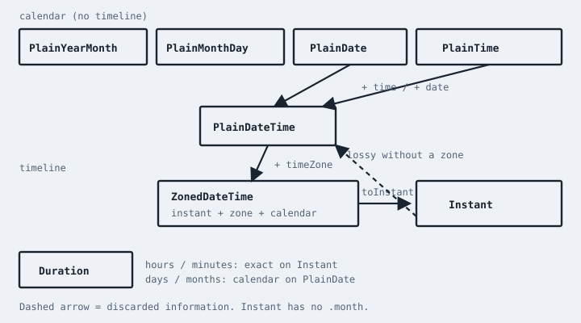

# You Don't Know JS Yet: ES.Next & Beyond - 2nd Edition
# Chapter 4: Temporal

`Date` is a mutable milliseconds-since-epoch value that pretends to be a calendar, a time zone, and a local clock at once. It parses strings loosely (and dangerously). Its months are 0-based. Its years have 1900 offsets in some constructors. It cannot represent "July 7" without a time zone. It cannot add "one month" correctly. It is, and remains, in the language -- because don't-break-the-web.

**Temporal** is the replacement. It reached **stage 4 in March 2026** and is part of the ES2026-era spec. Engines may still be catching up as you read this; polyfills exist. New code that cares about time should be Temporal-first, with `Date` as an interop boundary (`Date` ↔ `Temporal.Instant`).

This chapter is a map, not the entire Intl/Temporal spec (that's huge on purpose). If you learn the *types* and when to use which, you can read MDN for the method lists.

## What's Wrong Is The Model, Not Your Memory

`Date` stores **one thing**: an instant (UTC millis). Everything else -- `getHours()`, `getMonth()`, `toString()` -- is a *projection* into a local time zone (or UTC, if you remember `getUTC*` vs `get*`). There is no type for "a calendar date." There is no type for "3:30 in the afternoon, no date." There is no type for "this wall clock in Tokyo."

So people store `"2022-07-07"` in a `Date`, which is midnight UTC or local depending on the string form, then add a day and skip a DST hour, then ship a birthday email at 5pm the previous day in another country.

Temporal's answer: **different types for different concepts.** Mixing them is a type error, not a silent shift.

## The Types

The `Temporal` namespace holds the types. You don't `new Date()`. You use factory methods: `from`, `now`, `plainDateISO`, etc.

**`Temporal.Instant`** -- a unique point on the timeline (nanosecond precision internally, epoch nanoseconds). No time zone, no calendar. This is the honest `Date`.

```js
instant = Temporal.Now.instant();
instant = Temporal.Instant.from("2022-07-07T11:00:00Z");
instant.epochMilliseconds;           // number, for Date interop
```

**`Temporal.ZonedDateTime`** -- an instant **plus** a time zone **plus** a calendar. "What the wall clock in `America/Chicago` showed at that instant, in the Gregorian calendar." This is what you want for meetings, logs localized to a user, "what time is it there."

```js
zdt = Temporal.ZonedDateTime.from({
    timeZone: "America/Chicago",
    year: 2022,
    month: 7,
    day: 7,
    hour: 11
});

zdt.add({ days: 1 });
zdt.withTimeZone("Europe/Paris");
```

**`Temporal.PlainDate`** -- a calendar date, no time, no zone. Birthdays, due dates, "July 7, 2022." Adding a day is a calendar operation, not +86400000 ms.

**`Temporal.PlainTime`** -- a wall-clock time, no date, no zone. "9:30."

**`Temporal.PlainDateTime`** -- date + time, **no zone**. "July 7, 2022, 11:00." This is *not* an instant: 11:00 in Chicago and 11:00 in Paris are different instants. Promote to `ZonedDateTime` with a time zone when you mean an instant.

**`Temporal.PlainYearMonth`** / **`Temporal.PlainMonthDay`** -- "July 2022" / "July 7" (recurring).

**`Temporal.Duration`** -- a length of time in mixed units (`{ hours: 1, minutes: 30 }`). Calendar-aware when applied to calendar types; exact when applied to `Instant`.

Time zones and calendars are **string ids** (`"America/Chicago"`, `"iso8601"`, `"hebrew"`), not constructable `Temporal.TimeZone` / `Temporal.Calendar` classes. Those classes were removed from the proposal before Stage 4. Pass the id; don't look for a constructor.

```js
date = Temporal.PlainDate.from("2022-07-07");
date.add({ months: 1 });             // 2022-08-07

time = Temporal.PlainTime.from("11:00");

plain = date.toPlainDateTime(time);
zoned = plain.toZonedDateTime("UTC");
instant = zoned.toInstant();
```

The conversions are **explicit**. You cannot accidentally treat a birthday as an instant.

    

| WARNING: |
| :--- |
| `PlainMonthDay` has no `.month` you can treat like a `Date` month. Compare with `.equals`, or convert through `toPlainDate` in a year you chose. `PlainDate.until` will not take `largestUnit: "hours"` -- that's a `RangeError`, not "72." Intl formats an `Instant`, not a `ZonedDateTime`. The lattice is the chapter. |

Temporal values are also **immutable**. `zdt.add({ days: 1 })` returns a *new* `ZonedDateTime`. `Date#setHours` mutates in place and returns a number of milliseconds -- a completion value that looks like success and is easy to ignore. If you hold a Temporal object in a `Map` or in React state, you can treat it like a `string` or `number`: replacing it is how you change it. That alone eliminates a class of "I passed the meeting to three components and one of them called `setHours`."

### DST Is Why `+ 86400000` Is A Lie

`Date` "add one day" culture looks like this:

```js
var d = new Date("2022-03-12T08:00:00-06:00"); // Chicago, morning before DST springs forward
d.setTime(d.getTime() + 86400000);
d.toString();
// maybe 9:00 the next calendar day, maybe not -- depends on local offset
```

86400000 milliseconds is *exactly* 24 hours on the timeline. A *calendar* day in a DST zone is 23 or 25 hours twice a year. Birthday math, "every day at 8am," and "plus one day" are calendar operations. Timeline addition is for "the meeting is 90 minutes long" measured in real elapsed time.

```js
var zdt = Temporal.ZonedDateTime.from(
    "2022-03-12T08:00:00[America/Chicago]"
);

zdt.add({ days: 1 }).toString();
// 2022-03-13T08:00:00-05:00[America/Chicago]
// still 8:00 on the wall -- the offset changed, the clock time didn't

zdt.add({ hours: 24 }).toString();
// 2022-03-13T09:00:00-05:00[America/Chicago]
// 24 elapsed hours: 9:00 on the wall after the spring-forward skip
```

Read those two results until the difference is obvious. `{ days: 1 }` is *calendar*. `{ hours: 24 }` is *timeline*. `Date` only had the second one, and it *displayed* the first.

| NOTE: |
| :--- |
| `{ days: 1 }` keeps the wall clock. `{ hours: 24 }` keeps elapsed time. Mixing them is how `Date` taught a generation that "plus one day" was their fault. |

If you email "happy birthday" at `PlainDate` midnight converted through the user's *current* zone as an `Instant`, you will still get it wrong for people who moved. Store `PlainDate`. Instant-ize at send time, on purpose, with a zone you chose.

## `now`

```js
Temporal.Now.instant();
Temporal.Now.timeZoneId();
Temporal.Now.zonedDateTimeISO("America/Chicago");
Temporal.Now.plainDateISO();
```

`Date.now()` is `Temporal.Now.instant()` in spirit. The `Now` object is the clock. In tests, you still need to fake time at the edges -- Temporal doesn't make clocks pure; it makes *values* honest.

## Arithmetic And Rounding

```js
d = Temporal.PlainDate.from("2022-01-31");
d.add({ months: 1 });                // 2022-02-28 (overflow constrained)

instant.add({ hours: 1 });           // exact
```

Durations with months/years are calendar math. Durations with hours/seconds on `Instant` are timeline math. Mixing "add one month" onto an `Instant` is the kind of thing Temporal wants you to do *on a `ZonedDateTime` or `PlainDate`*, where a calendar exists.

`round`, `until`, `since`, `equals`, `with` (replace fields) are the verbs. Prefer them over pulling `.year` and doing `y + 1` yourself.

```js
var start = Temporal.PlainDate.from("2022-07-07");
var end = Temporal.PlainDate.from("2022-07-10");

start.until(end).toString();     // "P3D"
start.equals(end);               // false
start.with({ day: 10 }).equals(end);  // true

var meeting = Temporal.ZonedDateTime.from(
    "2022-07-07T11:00:00[America/Chicago]"
);
meeting.with({ hour: 14 }).hour; // 14 -- meeting itself unchanged
meeting.hour;                    // 11
```

`equals` is the Temporal-aware comparison. `===` is still identity of the object wrapper -- two `PlainDate`s that mean the same civil day are not `===` unless they're the same reference. That's *Types & Grammar* again: objects compare by identity; Temporal makes you say `equals` when you mean value. Don't `==` them and hope.

Overflow options (`constrain` vs `reject`) decide whether Jan 31 + 1 month is Feb 28 or a throw. Pick one at the boundary of your app and stick to it.

## Parsing

Temporal `from` / `from` ISO strings are **strict** compared to `new Date(string)`. That's good. Garbage that `Date` accepted ("July 4 2022", slash vs dash, timezone-less strings that are UTC in ES5 and local in ES2015) is how we got the meme.

Prefer ISO-8601-style strings. Prefer carrying a zone or offset when you mean an instant. Store:

* instants as ISO UTC (`...Z`) or epoch nanoseconds
* civil dates as `YYYY-MM-DD`
* time zones as IANA ids

Don't store `Date#toString()` output. Don't store local `Date` millis and guess the zone later.

### Offset Is Not A Time Zone

Try the old traps on purpose, in an engine that still has `Date`, so you remember why Temporal is strict:

```js
new Date("2022-07-07");
// ES5: UTC midnight. ES2015 date-only ISO: UTC. Some hosts: local.
// the workshop date just moved by your laptop's offset.

new Date("2022-07-07T11:00:00");
// no Z, no offset: treated as *local* in ES2015 -- "local" of *this machine*

new Date("July 7, 2022");
// implementation-defined. Maybe valid. Maybe Invalid Date. Maybe US-only.

Temporal.PlainDate.from("2022-07-07");           // ok
Temporal.Instant.from("2022-07-07T11:00:00");    // throw -- not an instant
Temporal.Instant.from("2022-07-07T11:00:00Z");   // ok
Temporal.ZonedDateTime.from(
    "2022-07-07T11:00:00[America/Chicago]"
);                                               // ok
Temporal.PlainDate.from("July 7, 2022");         // throw
```

The throws are the feature. `Instant.from` without a `Z` or offset is "you have not told me when in the universe." `PlainDate.from` with a junk string is "that is not a date." `Date` would guess. Guessing is how birthday emails landed yesterday.

Offset vs IANA id: `2022-07-07T11:00:00-05:00` is an instant (that offset, that civil time). It is **not** "always Chicago." Chicago in July is `-05:00` (CDT); Chicago in January is `-06:00` (CST). If you persist only the offset, you cannot later ask "what was the wall clock in Chicago" after a zone-rule change. Persist the IANA id when the *place* matters; persist `Z` when the *instant* matters.

## Interop With `Date`

```js
date = new Date(instant.epochMilliseconds);
instant = Temporal.Instant.fromEpochMilliseconds(date.getTime());
```

Old APIs still want `Date` (some DOM, some DB drivers). Convert at the edge. Inside the app, Temporal types. If a library returns `Date`, wrap it immediately.

## Intl And Temporal

`Intl.DateTimeFormat` can format Temporal objects (as implementations catch up) with the same locale options you already use. Display is Intl's job. Representation is Temporal's. Don't `plainDate.toString()` into the UI and call it localized.

```js
var fmt = new Intl.DateTimeFormat("en-US", {
    timeZone: "America/Chicago",
    weekday: "long",
    month: "long",
    day: "numeric",
    hour: "numeric",
    minute: "2-digit"
});

fmt.format(workshop.toInstant());
// "Thursday, July 7 at 11:00 AM"

// fmt.format(workshop) throws TypeError
```

Intl will not format a `ZonedDateTime`[^IntlInstant]: the ZDT already has a zone, and the formatter may have another. Convert to `Instant` (or `PlainDate` / `PlainDateTime`) at the edge.

| NOTE: |
| :--- |
| ECMA-402's `format` accepts an `Instant`. Engines that have not wired Temporal into `Intl` still call `valueOf`, which Instant forbids -- a `TypeError` that looks like "Intl refuses Temporal" when it is "Intl still wants a `Date`." Pass `new Date(instant.epochMilliseconds)` at that edge, and delete it when `format(instant)` returns a string. |

Two clocks in that snippet: Temporal's `workshop` already *is* Chicago. Intl's `timeZone` option is a *second* projection of the instant. Pass `timeZone` to match the *viewer*. Don't pass a `ZonedDateTime` and hope the engine picks the ZDT's zone -- it is specified not to.

`formatToParts` is how you style "July" differently from "11:00" without regex on a localized string. The grain from *Types & Grammar*: don't parse what you can keep structured.

```js
fmt.formatToParts(workshop.toInstant()).find(function part(p){
    return p.type == "weekday";
}).value;
// "Thursday"
```

Store Temporal. Format Intl. If you `workshop.toString()` into a React tree, you'll show ISO-with-brackets to users and call it done.

## A Worked Choice

* **Logging / tracing / DB timestamps:** `Instant` (UTC).
* **User's "today":** `PlainDate` in their calendar + time zone, derived from `Now.zonedDateTimeISO(userTz).toPlainDate()`.
* **Meeting at 10:00 in Chicago:** `ZonedDateTime`.
* **Recurring April 15 tax day:** `PlainMonthDay`.
* **Timer for 30 seconds:** `Duration` + `Instant`, or just millis if it's a stopwatch and you don't need calendars.

If you pick one type for everything (`ZonedDateTime` everywhere, or `Instant` everywhere), you're reimplementing `Date`'s mistake with better branding. The types are there to *narrow* what operations are legal.

## See The Type

Definitions of `PlainDate` are cheap. Watching a workshop program *refuse* to mix a birthday with a meeting instant is the part that sticks -- the same way watching `greetStudent` still see `students` was the point of closure, not the dictionary definition.

Suzy's birthday is July 7. The YDKJS workshop is July 7, 2022, 11:00 in Chicago, 90 minutes. We need to (1) store the birthday, (2) store the workshop, (3) ask if the workshop falls on her birthday in Chicago, (4) send a log line when the workshop *actually happens*.

```js
var suzyBirthday = Temporal.PlainMonthDay.from({
    month: 7,
    day: 7
});

var workshop = Temporal.ZonedDateTime.from({
    timeZone: "America/Chicago",
    year: 2022,
    month: 7,
    day: 7,
    hour: 11,
    minute: 0
});

var workshopDate = workshop.toPlainDate();
var isBirthdayWorkshop = workshopDate
    .toPlainMonthDay()
    .equals(suzyBirthday);

isBirthdayWorkshop;          // true

var started = workshop.toInstant();
// log this, persist this, ship this to another machine
started.toString();
// "2022-07-07T16:00:00Z"  -- 11:00 Chicago was 16:00 UTC that day
```

Stay here.

`suzyBirthday` has no year, no zone, no "when in the universe." You cannot `toInstant()` it. `PlainMonthDay` also has no `.month` number -- the civil month is `.monthCode` (`"M07"`), because some calendars don't have a single numeric month that matches ISO. Comparing `.month` to a `PlainDate`'s `.month` is `undefined == 7`. Convert with `toPlainMonthDay()` (or compare `.monthCode` and `.day`) so the types agree.

`workshop` is a wall clock in a zone. `toPlainDate()` *drops* time and zone on purpose -- "the calendar day this meeting sits on in its own zone." Comparing that to `PlainMonthDay` is civil-calendar comparison. We did not convert the birthday to UTC midnight. UTC midnight of July 7 is a different civil day in Tokyo.

`toInstant()` is the moment the universe agrees on. The log line is an `Instant`. If you store `workshop.toString()` with the zone bracket, that's a `ZonedDateTime` serialization -- also honest, but it's not the same as an instant: a future politician can change the Chicago offset, and a stored `ZonedDateTime` string might mean a different instant when re-parsed. Instants don't care about politicians. Civil times do. Pick which you meant.

### The Ambiguous Local Time

Chicago springs forward: local 2:00--3:00 doesn't exist. It falls back: local 1:00 happens twice.

```js
// this local time does not exist on that day:
Temporal.ZonedDateTime.from({
    timeZone: "America/Chicago",
    year: 2022,
    month: 3,
    day: 13,
    hour: 2,
    minute: 30
});
// 2022-03-13T03:30:00-05:00[America/Chicago]
// default disambiguation is "compatible" -- it slides into existence

Temporal.ZonedDateTime.from({
    timeZone: "America/Chicago",
    year: 2022,
    month: 3,
    day: 13,
    hour: 2,
    minute: 30
}, { disambiguation: "reject" });
// RangeError
```

`Date` would invent *something* -- usually a shifted wall time -- and smile. Temporal's default `compatible` is that same family of guess (here, 2:30 becomes 3:30). Pass `disambiguation: "reject" | "earlier" | "later" | "compatible"` on purpose.[^TemporalDisambiguation] Reject is the one I want at a form boundary: "that meeting time doesn't exist, pick another." Compatible is the one APIs use to match `Date`'s old guesses when they must.

Fall-back is the opposite bug: 1:30am happens twice. `from` without disambiguation is underspecified. Make it specified.

This is why `PlainDateTime.toZonedDateTime(zone)` is a *lossy, policy-bearing* conversion, not a cast. You are asserting "this civil time in this zone," and some civil times are not a unique instant. Book 4's coercions had corner cases. Time has them too. Name the policy.

### Calendars Are Not Always Gregorian

```js
var iso = Temporal.PlainDate.from("2022-07-07");
iso.calendarId;              // "iso8601"

var hebrew = iso.withCalendar("hebrew");
hebrew.year;                 // not 2022
hebrew.toString();           // includes the calendar annotation
```

`PlainDate` is always a date *in a calendar*. ISO is the default, not the only one. Arithmetic follows the calendar. If you `add({ months: 1 })` on a Hebrew date, that's a Hebrew month. Don't convert to ISO, add, and convert back "to be safe" -- you'll invent a different day.

Most US workshop software can live on `iso8601` and IANA zones. The type is still carrying a calendar so that "July 7" in another system is not silently Gregorian. `Intl` displays it. Temporal stores it. Don't mash them into one `toString()`.

### What We Stored

| Fact | Type | Not |
| :--- | :--- | :--- |
| Suzy's recurring birthday | `PlainMonthDay` | `Date`, `Instant` |
| Workshop on a wall clock | `ZonedDateTime` | `PlainDateTime` alone |
| "Did it fall on July 7 in Chicago?" | compare `PlainDate` fields | UTC midnight |
| Log / DB "when it happened" | `Instant` | local `Date#toString()` |
| "90 minutes long" | `Duration` | `end Instant - start` mashed into a date |

If your code has a function `toDate()` that everything funnels through, you built `Date` again. Split the function. The types are the documentation.

### Two Cities, One Instant

Kyle is in Chicago. Suzy is in Paris. The workshop starts at 11:00 Chicago time. Both of them want a clock face. There is still only *one* instant.

```js
var chicago = Temporal.ZonedDateTime.from({
    timeZone: "America/Chicago",
    year: 2022,
    month: 7,
    day: 7,
    hour: 11
});

var paris = chicago.withTimeZone("Europe/Paris");

chicago.toInstant().equals(paris.toInstant());  // true
chicago.hour;    // 11
paris.hour;      // 18
chicago.toPlainDate().equals(paris.toPlainDate());
// true -- both still July 7

var lateChicago = chicago.with({ hour: 22 });
lateChicago.withTimeZone("Europe/Paris").toPlainDate().toString();
// "2022-07-08" -- a late Chicago evening is already tomorrow in Paris
```

`withTimeZone` does **not** keep 11:00 and move the zone (that would be a different instant -- "11:00 in Paris"). It keeps the instant and *projects* a new wall clock. That's the operation people meant when they called `toLocaleString` on a `Date` and hoped. Here it's typed.

The opposite -- "same civil time, different zone" -- is a *new* instant:

```js
var elevenParis = chicago.toPlainDateTime()
    .toZonedDateTime("Europe/Paris");

elevenParis.hour;            // 11
chicago.toInstant().equals(elevenParis.toInstant());  // false
```

Read those two snippets until you can say which one is "what time is it for Suzy when Kyle's workshop starts" and which one is "Suzy's own 11:00 meeting." Mixing them is the `Date` bug with better names.

A recurring "every Wednesday at 11:00 Chicago" is *not* an `Instant` you add 7 * 86400000 to. It's a civil rule: next Wednesday, 11:00, that zone, with DST handled by `ZonedDateTime` arithmetic on `{ weeks: 1 }` or by asking the calendar for the next Wednesday then attaching 11:00. Libraries (and Temporal's own calendar queries) exist for "next Wednesday." Don't roll a weekday loop on `epochMilliseconds`.

### Rounding Is Display, Mostly

```js
var d = Temporal.Duration.from({ hours: 1, minutes: 90 });
d.round({ largestUnit: "hours" }).toString();
// "PT2H30M" -- 90 minutes is 1h30m, plus the 1h already there
```

Durations can be *unbalanced* (`{ hours: 1, minutes: 90 }` is legal). `round` / `balance` (via round options) is how you make them printable. Don't write `minutes % 60` by hand unless you like off-by-ones at 24-hour boundaries.

```js
chicago.round({
    smallestUnit: "minute",
    roundingMode: "floor"
});
```

That's "display this meeting without seconds," not "mutate the stored instant." Store precise, round at the edge -- same grain as money. `roundingMode` (`floor`, `ceil`, `halfExpand`, ...) is policy. Pick it for the product ("always show the minute we started") and leave it in one helper.

## `scheduleMeeting` Without `Date`

*Get Started* Appendix B asked you to compare `"07:30"` strings with coercion. That exercise was about types. Here's the same job as a *calendar* problem -- a workshop that must stay inside a work day, in a real time zone, without inventing a minute-of-day integer by hand.

```js
function scheduleMeeting(startTime,durationMinutes,workDay) {
    // workDay: { timeZone, date, start, end }
    // startTime: "HH:mm"
    // durationMinutes: number

    var date = Temporal.PlainDate.from(workDay.date);
    var start = Temporal.PlainTime.from(startTime);
    var dayStart = Temporal.PlainTime.from(workDay.start);
    var dayEnd = Temporal.PlainTime.from(workDay.end);

    var meetingStart = date
        .toPlainDateTime(start)
        .toZonedDateTime(workDay.timeZone);
    var meetingEnd = meetingStart.add({
        minutes: durationMinutes
    });
    var workStart = date
        .toPlainDateTime(dayStart)
        .toZonedDateTime(workDay.timeZone);
    var workEnd = date
        .toPlainDateTime(dayEnd)
        .toZonedDateTime(workDay.timeZone);

    return (
        Temporal.ZonedDateTime.compare(
            meetingStart, workStart
        ) >= 0 &&
        Temporal.ZonedDateTime.compare(
            meetingEnd, workEnd
        ) <= 0
    );
}

var workDay = {
    timeZone: "America/Chicago",
    date: "2022-07-07",
    start: "07:30",
    end: "17:45"
};

scheduleMeeting("07:30",30,workDay);     // true
scheduleMeeting("17:30",30,workDay);     // false
```

Walk it slowly. Don't skip -- this is the `lookupStudent` of the chapter, just with clocks instead of closures.

1. `workDay.date` is a civil day. `PlainDate.from("2022-07-07")` has no 11:00, no Chicago, no UTC. It is the workshop *day*.
2. `startTime` `"07:30"` is a `PlainTime`. It is not "07:30 UTC" and it is not "07:30 in the user's laptop zone." It is a wall-clock time waiting to be *placed*.
3. `date.toPlainDateTime(start)` is still not an instant. It is "July 7, 2022, 07:30" with **no zone**. 07:30 in Chicago and 07:30 in Paris are different moments. The type is telling you that.
4. `.toZonedDateTime(workDay.timeZone)` is the assertion: this civil time, in Chicago. *Now* you have a unique instant (on a day that isn't a DST gap -- see disambiguation above).
5. `meetingEnd = meetingStart.add({ minutes: durationMinutes })` is timeline-ish minutes on a zoned value: 30 minutes later on the clock, through whatever offset Chicago has at that moment. We did **not** add `30 * 60 * 1000` to a `Date` and hope.
6. `compare` asks "is this zoned value before/after that one?" It does not subtract and inspect the sign of a number you hoped was milliseconds.

`scheduleMeeting("17:30",30,workDay)` is false because 17:30 plus 30 minutes is 18:00, and the work day ends 17:45. The meeting *starts* inside the day and *ends* outside. The *Get Started* string comparison (`"17:30" < "17:45"`) could not see the duration. Temporal can, because we modeled an interval, not a start string.

DST: if the work day were March 13, 2022 in Chicago, `{ minutes: 30 }` across the gap still means 30 elapsed minutes on the zoned value -- the wall clock may jump. `{ days: 1 }` would keep 07:30 on the wall the next calendar day. Pick the unit that matches the *question*. "Is this meeting 30 minutes long?" is minutes. "Is the workshop tomorrow at the same clock time?" is days.

### Overflow Is A Policy

```js
var jan31 = Temporal.PlainDate.from("2022-01-31");

jan31.add({ months: 1 });
// 2022-02-28 -- constrain (default): Feb has no 31st

jan31.add({ months: 1 }, { overflow: "reject" });
// RangeError
```

`Date` would give you March 3, or Feb 28, or something that depended on the setter you used -- and it would mutate `jan31` if you had a `Date`. Temporal returns a new value, and it asks you whether "no such day" is a clamp or a throw.

Pick `reject` at user input ("there is no January 32"). Pick `constrain` for "next month, same-ish day" billing cycles if that's the product rule. **Pick it once** in a helper, don't sprinkle overflow options through the app. Silent constrain in one file and reject in another is how Suzy's invoice lands on March 3.

Years and leap days are the same family: Feb 29, 2024 plus one year is Feb 28, 2025 under constrain. That's not a bug. That's a calendar.

### `until` Is Not Subtraction

```js
var start = Temporal.PlainDate.from("2022-07-07");
var end = Temporal.PlainDate.from("2022-07-10");

start.until(end).toString();          // "P3D"
start.until(end, { largestUnit: "hours" }); // RangeError
```

`PlainDate.until`[^PlainDateUntil] is *calendar* distance (`largestUnit` must be day..year). Three days. Not 72 hours -- those three days might contain a DST 23-hour day if you had zoned times. Elapsed hours need `ZonedDateTime` or `Instant`.

```js
var a = Temporal.ZonedDateTime.from(
    "2022-03-12T08:00:00[America/Chicago]"
);
var b = a.add({ days: 2 });

a.until(b).toString();
// a duration whose calendar days are 2

a.toInstant().until(b.toInstant()).toString();
// exact elapsed time -- not 48:00:00 if a DST boundary sits in between
```

If you `end.epochMilliseconds - start.epochMilliseconds` you've thrown away the type and reimplemented `Date`. `until` / `since` keep the question attached to the value: civil distance vs exact duration. Round when you need to *display* "in 2 days" vs "in 47 hours."

```js
workshop.until(
    workshop.add({ minutes: 90 }),
    { largestUnit: "hours" }
);
// "PT1H30M"
```

Ninety minutes of workshop as a duration you can put in a UI, without building a `Date` and dividing by 3600000.

### Convert At The Edge

```js
function workshopFromLegacy(date,timeZone) {
    return Temporal.Instant
        .fromEpochMilliseconds(date.getTime())
        .toZonedDateTimeISO(timeZone);
}

function workshopToLegacy(zdt) {
    return new Date(zdt.toInstant().epochMilliseconds);
}
```

A DB driver hands you a `Date`. Wrap it *immediately* in the function that knows the zone the product meant. Don't pass the `Date` through five helpers "for now." Five helpers later, someone calls `getHours()` and you've got local-machine hours in a server log.

The opposite edge: a `<input type="datetime-local">` is a `PlainDateTime` (no zone -- that's what the control is). You attach the user's zone (or the workshop's zone) *on purpose* when you mean a meeting. If you `new Date(input.value)` you get the ES5-vs-ES2015 string hazard Book 4 already warned you about, dressed up as HTML.

```js
function meetingFromInput(value,timeZone) {
    // value: "2022-07-07T11:00"
    var plain = Temporal.PlainDateTime.from(value);
    return plain.toZonedDateTime(timeZone, {
        disambiguation: "reject"
    });
}
```

`reject` on a DST gap: the form is wrong, tell the user. Don't invent 3:00.

## Walk `scheduleMeeting` Across A Spring-Forward

Chicago, March 13, 2022: 2:00 AM does not exist. Clocks jump to 3:00. *Get Started*'s `"07:30"` strings never felt that. `Date` felt it as "sometimes 23-hour days" and then people added `86400000` anyway.

I want a workshop that starts at 1:30 AM local (before the gap) and one that *claims* 2:30 AM (inside the gap). Same `scheduleMeeting` types as earlier in the chapter. Predict, then type.

```js
var workDay = {
    timeZone: "America/Chicago",
    date: "2022-03-13",
    start: "00:00",
    end: "23:59"
};

function zonedOn(dateStr, timeStr, timeZone, disambiguation) {
    var date = Temporal.PlainDate.from(dateStr);
    var time = Temporal.PlainTime.from(timeStr);
    return date
        .toPlainDateTime(time)
        .toZonedDateTime(timeZone, { disambiguation: disambiguation });
}

// 1:30 AM exists
var beforeGap = zonedOn(
    workDay.date, "01:30", workDay.timeZone, "reject"
);
beforeGap.toString();
// 2022-03-13T01:30:00-06:00[America/Chicago]

// 2:30 AM does not exist -- reject
try {
    zonedOn(workDay.date, "02:30", workDay.timeZone, "reject");
}
catch (err) {
    console.log("gap", err.name);
}
```

`compatible` (the default on some conversions -- check the option you pass) will *slide* 2:30 to 3:30. That's a product decision: did the user mean "ninety minutes after 1:00" or "the wall clock that says 2:30"? Those are different Instant values on this night. `Date` hid the question inside a parse. Temporal makes you pick.

A 90-minute workshop starting at 1:30 AM:

```js
var start = zonedOn(
    workDay.date, "01:30", workDay.timeZone, "reject"
);
var end = start.add({ minutes: 90 });
end.toPlainTime().toString();
// 04:00 -- 01:30 CST plus 90 elapsed minutes is 04:00 CDT
// (the spring-forward hour never existed)
```

You added a `Duration`. You did **not** add 90 * 60 * 1000 to a millis field and hope. Minutes (and hours) on a `ZonedDateTime` are **exact** timeline units: 90 minutes of elapsed time. Years, months, weeks, and days are **calendar** units: `{ days: 1 }` keeps 1:30 on the wall the next civil day. If the result surprises you, print `start.toInstant()` and `end.toInstant()` and `until`. Two questions, two kinds of unit.

Fall-back (November) has the opposite problem: 1:30 AM happens twice. `earlier` / `later` / `reject` are again product choices. A log line should have been an `Instant` so it cannot be ambiguous. A wall-clock meeting should be a `ZonedDateTime` with an explicit disambiguation at the *edge* (the form), not in a helper five calls deep.

```js
function scheduleMeeting(startTime, durationMinutes, workDay) {
    var date = Temporal.PlainDate.from(workDay.date);
    var start = Temporal.PlainTime.from(startTime);
    var dayStart = Temporal.PlainTime.from(workDay.start);
    var dayEnd = Temporal.PlainTime.from(workDay.end);

    var meetingStart = date
        .toPlainDateTime(start)
        .toZonedDateTime(workDay.timeZone, {
            disambiguation: "reject"
        });
    var meetingEnd = meetingStart.add({
        minutes: durationMinutes
    });
    var workStart = date
        .toPlainDateTime(dayStart)
        .toZonedDateTime(workDay.timeZone, {
            disambiguation: "compatible"
        });
    var workEnd = date
        .toPlainDateTime(dayEnd)
        .toZonedDateTime(workDay.timeZone, {
            disambiguation: "compatible"
        });

    return (
        Temporal.ZonedDateTime.compare(
            meetingStart, workStart
        ) >= 0 &&
        Temporal.ZonedDateTime.compare(
            meetingEnd, workEnd
        ) <= 0
    );
}
```

Work bounds use `compatible` so "the office is open that civil day" still has instants if the bounds themselves are weird. The *meeting* uses `reject` so a 2:30 AM booking on spring-forward fails closed. Two policies. Named. That's types, not millis folklore.

If you only remember one Temporal sentence from this book: **pick the type that matches the question, then pick disambiguation at the edge.** `Instant` for "when did this happen." `PlainDate` for "Suzy's birthday." `ZonedDateTime` for "class starts at 11 in Chicago." `Duration` for "ninety minutes." `Date` for interop at the adapter. Five nouns. Appendix B will make you name them without the chapter sitting open.

The *Get Started* version of `scheduleMeeting` was the right exercise for Book 1. This is the right exercise for a language that finally grew dates. If your engine doesn't have `Temporal` yet, that's an implementation lag, not a reason to keep mutating `Date`. Polyfill, or skip the run and still *write* the types.

Chapter 5 looks past what's already in the spec: the proposals that might change how you write JS next year -- and the ones that might vanish like Records did.

[^TemporalDisambiguation]: "Temporal.ZonedDateTime.from ( item [ , options ] )", `disambiguation` option, Temporal proposal (Stage 4, March 2026); https://tc39.es/proposal-temporal/#sec-temporal.zoneddatetime.from ; Accessed September 2026

[^PlainDateUntil]: "Temporal.PlainDate.prototype.until ( other [ , options ] )", largestUnit constrained to date units; https://tc39.es/proposal-temporal/#sec-temporal.plaindate.prototype.until ; Accessed September 2026

[^IntlInstant]: "DateTimeFormat.prototype.format ( dateTime )", ECMA-402; `Temporal.ZonedDateTime` is not a valid input — pass an `Instant` (or a `Date`); https://tc39.es/ecma402/#sec-datetimeformat.prototype.format ; Accessed September 2026
