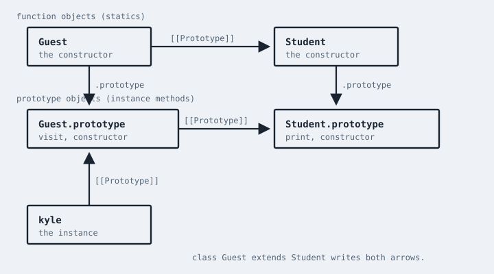

# You Don't Know JS Yet: Objects & Classes - 2nd Edition
# Appendix B: Prototypal Classes & Protected Visibility

Two leftovers from the main chapters belong together: the pre-`class` "prototypal class" pattern you'll still find in older code (and, infuriatingly, in job interviews), and the *protected* visibility JS refuses to grow -- plus why that refusal is not an oversight.

## Prototypal Classes

Before ES6 `class`, JS developers who wanted class-orientation wired it up by hand. The pattern is still legal. It is also the same mechanism `class` desugars to, which is why understanding it is useful even if you never write it again.

```js
function Point2d(x,y) {
    this.x = x;
    this.y = y;
}

Point2d.prototype.getX = function getX() {
    return this.x;
};

function Point3d(x,y,z) {
    Point2d.call(this,x,y);
    this.z = z;
}

Point3d.prototype = Object.create(Point2d.prototype);
Point3d.prototype.constructor = Point3d;

Point3d.prototype.getZ = function getZ() {
    return this.z;
};

var point = new Point3d(3,4,5);

point.getX();                         // 3
point.getZ();                         // 5
point instanceof Point3d;             // true
point instanceof Point2d;             // true
```

Every piece of that snippet is doing something `class` now does for you:

1. `function Point2d(..) { this.x = x; .. }` is the constructor. `class Point2d { constructor(x,y) { .. } }` is the same function with nicer clothes.
2. Methods assigned to `Point2d.prototype` are the ones instances delegate to. `class` methods land in the same place.
3. `Point2d.call(this,x,y)` is `super(x,y)` -- invoke the parent constructor against *this* instance.
4. `Point3d.prototype = Object.create(Point2d.prototype)` is `class Point3d extends Point2d`. That's the `[[Prototype]]` link between the two `.prototype` objects.
5. Resetting `.constructor` is a detail `class` also handles, so `point.constructor === Point3d`.

| WARNING: |
| :--- |
| A common bug in this pattern is `Point3d.prototype = Point2d.prototype` (assignment instead of `Object.create(..)`). That makes both "classes" share **the same** prototype object, so adding `getZ` also makes it appear on `Point2d` instances. `Object.create(..)` makes a *new* object linked to the parent prototype. Don't skip it. |

`class` also adds things this pattern does not give you for free: `super` in methods (not just constructors), `new.target`, static inheritance, private `#` fields, and TDZ-style errors if you forget `new`. That's why I don't recommend writing prototypal classes in new code. I *do* recommend being able to read them, because:

* lots of libraries written before 2015 still look like this
* `class` is not a different object model; it's this object model with syntax
* interviewers still ask about it, for reasons that have more to do with inertia than with good hiring

*Get Started* Appendix A has a shorter version of this same comparison. The version here is the one to come back to after Chapters 2--5, once `[[Prototype]]`, `this`, and `class` are all on the table.

## Protected Visibility

Chapter 3 noted that JS has `public` (the default) and `private` (`#`), but not *protected* -- members visible to a class *and its subclasses*, but not to the outside world.

If you've used Java or C++, the omission feels like a missing rung on the ladder. Protected is, in practice, more useful than private for any hierarchy that's actually meant to be extended: a subclass that cannot see the state it's supposed to specialize is a subclass in name only.

So why doesn't JS have it? Not because TC39 hasn't thought about it. Protected has been proposed, discussed, and re-discussed for well over a decade. It keeps failing for a reason that sits right on top of JS's object pillar.

### Privacy Is Per-Class, Sharing Is Per-Object

JS instance "inheritance" is `[[Prototype]]` delegation between objects. Privacy (`#`) is a *class-scoped* privilege: only code that appears *in that class body* may mention `#ID`. The two mechanisms don't share a joint.

```js
class Point2d {
    #x = 3

    getX() {
        return this.#x;
    }
}

class Point3d extends Point2d {
    getX() {
        // SyntaxError if you uncomment:
        // return this.#x;
        return super.getX();
    }
}
```

`#x` is not "a hidden property on the instance that subclasses can see if they know the secret." It is a *brand* associated with the `Point2d` class. The instance carries the private slot, but only `Point2d`'s code has the key. `Point3d` is a different class, so it does not have the key -- even though `this` is a `Point3d` instance that *is* `[[Prototype]]`-linked to `Point2d.prototype`.

That is consistent with how `#` works. It is also exactly why *protected* is hard. Protected would mean: "this slot is visible to `Point2d` *and* to any class that extends it, possibly through several layers, possibly to classes that didn't exist when `Point2d` was authored."

In a copy-down class model, that's natural: the child *is* the parent, plus more, so of course it can see protected members. In a delegation model, the child is a *different object* (actually: a different prototype object, plus an instance) linked to the parent. There is no "the rest of me." There is only "that other object I hand work to."

Giving `Point3d` the ability to mention `#x` would mean either:

1. **Weakening privacy** so that any code along the `[[Prototype]]` chain can access private slots -- which makes `#` not actually private, and breaks the brand-check semantics (`#x in obj`) that libraries already rely on; or
2. **Installing a second, different privacy channel** ("protected slots") whose visibility is defined by the class *hierarchy* rather than by the class *body* -- which means the object system's sharing (prototype links, which are mutable! `Object.setPrototypeOf(..)`) and the class system's hierarchy have to stay in perfect agreement forever.

JS lets you mutate `[[Prototype]]` at runtime. JS lets you extend expressions (Chapter 3). JS lets two classes share a prototype object if you force them to. A protected-visibility rule that is correct in the presence of all of that is a specification nightmare, and an implementation nightmare on top of it.

### Workarounds (And Why They're Workarounds)

People do emulate protected. The usual tricks:

**Protected by convention.** Prefix with `_` and document "don't touch this." This is social, not mechanical. It's also what JS did for decades, and it still works if your team is disciplined.

**Module-scope WeakMap.** Hold "protected" state in a `WeakMap` that only the module's classes close over:

```js
var protectedState = new WeakMap();

class Point2d {
    constructor(x) {
        protectedState.set(this,{ x });
    }
    getX() {
        return protectedState.get(this).x;
    }
}

class Point3d extends Point2d {
    bumpX() {
        protectedState.get(this).x += 1;
    }
}
```

Both classes can see the state because both close over the same `WeakMap`. Outside the module, nobody can. That's actually a pretty good *protected*. The costs: it's not syntax, it doesn't work across package boundaries unless you share the `WeakMap`, and subclasses defined elsewhere are back to having no access.

**Protected methods via `super`.** Keep the slot private, and expose a deliberately narrow public or subclass-facing method that the child is supposed to call. This is the "template method" style from Chapter 3. It works. It also means you're designing your base class's public surface around the needs of unknown future subclasses -- the opposite of hiding.

None of these is *protected* the keyword. They're all "we don't have that keyword, here's the grain of the language instead."

### Living Without It

My advice, same as in Chapter 3: don't structure JS class hierarchies as if protected were coming any day now. Prefer:

* **shallow hierarchies** (one level of `extends` is already a lot)
* **composition** (hand an object a helper object, rather than inheriting its guts)
* **delegation** (Chapter 5) when the relationship is "please handle this for me," not "I am a kind of you"
* **private `#` for true internals** of a *single* class, not for state you already know a subclass will need

If a subclass *must* see it, it's not private. Make it public, or pass it explicitly, or keep both classes in a module and share a `WeakMap`. Those are honest designs. Pretending JS has protected by hanging `_foo` on `this` and hoping nobody notices is not.

JS's object pillar is linking, not copying. Privacy that follows the class body is consistent with that pillar. Privacy that follows the subclass tree is consistent with a different pillar, in a different language. That's why protected is unlikely -- and why I don't want you waiting for it.

## See The Shared Prototype Bug

```js
function Student(name) {
    this.name = name;
}

Student.prototype.print = function print(){
    console.log(this.name);
};

function Guest(name) {
    Student.call(this,name);
}

Guest.prototype = Student.prototype;     // BUG
Guest.prototype.visit = function visit(){
    console.log("visit", this.name);
};

var suzy = new Student("Suzy");
suzy.visit();                            // visit Suzy  -- Guest leaked onto Student
```

`Guest.prototype = Student.prototype` means there is **one** object. Adding `visit` adds it for everyone who delegates there. `instanceof` still looks "fine." The bug is shared mutable identity of the prototype object.

```js
Guest.prototype = Object.create(Student.prototype);
Guest.prototype.constructor = Guest;
```

Now `visit` lives on a *new* object whose `[[Prototype]]` is `Student.prototype`. `suzy.visit` is `undefined`. That's the `extends` desugar. The figure in "Statics Are A Parallel Chain" is this graph; if you cannot point at the two arrows, you cannot debug it in a 2014 codebase.

`class Guest extends Student {}` will not make this mistake. Hand-wiring will, forever, which is why this appendix still exists.

## Statics Are A Parallel Chain

```js
class Student {
    static load(id) {
        return { id, name: "Suzy" };
    }
}
class Guest extends Student {}
Guest.load(73);                          // works -- statics inherit
```

`class` links `Guest` (the function object) `[[Prototype]]` to `Student` (the function), so statics delegate too. Hand-wiring `Guest.prototype = Object.create(Student.prototype)` does **not** by itself make `Guest.load` work. You also need `Object.setPrototypeOf(Guest, Student)` (or `Guest.__proto__ = Student`, which you should not write). Forget that line and statics look "broken" in a 2014 class pattern. `class` wrote both links. That's another reason not to hand-wire new code -- two chains, easy to do one.

```js
Object.getPrototypeOf(Guest) === Student;           // true
Object.getPrototypeOf(Guest.prototype) ===
    Student.prototype;                              // true
```

    

Both arrows. Interviews that only ask about `.prototype` are asking about half the desugar. If you cannot draw this, you cannot debug a 2014 `Guest.prototype = Student.prototype` leak — that bug is the two objects becoming one.

## `new.target` And The Forgotten `new`

```js
function Student(name) {
    if (!new.target) {
        throw new Error("Student() must be called with new");
    }
    this.name = name;
}

class Guest {
    constructor(name) {
        this.name = name;
    }
}

Student("Kyle");             // throws if you wrote the guard
Guest("Kyle");               // TypeError from `class` itself
```

`class` constructors throw without `new`. Old `function` constructors silently pollute `globalThis` in sloppy mode (`this.name = name` on the global). That's why the prototypal-class era grew `if (!(this instanceof Student))` guards, then `new.target`. `class` made the guard the default.

When you read a 2014 `function Point2d`, look for that guard. If it is missing, `Point2d(3,4)` without `new` is a bug waiting for strict mode -- or a global leak. `class` is not "OOP fashion." It is, among other things, that footgun welded shut.

## `super()` Before `this`

```js
class Guest extends Student {
    constructor(name) {
        this.tag = "guest";  // ReferenceError -- TDZ of `this`
        super(name);
    }
}
```

Hand-wired `Student.call(this,name)` could run in any order you typed. `class` / `extends` requires `super()` before `this` because the instance isn't initialized until the parent constructor returns. That's not pedantry. That's the engine allocating the instance (and private slots) on the way up the constructor chain.

If you convert a prototypal class to `class` and the constructor "suddenly" TDZ-throws, you were using `this` before the parent ran. The old pattern let you. The new one doesn't. Fix the order; don't smear `super` into a helper so you can pretend.

I still don't want you writing prototypal classes in new code. I want you able to *read* the two chains, the `Object.create` vs assignment bug, the missing `.constructor`, the static link, and `super()`-before-`this` -- because that's the object model `class` is sitting on, not a different language.

## Readable Desugar

When you see:

```js
class Guest extends Student {
    constructor(name) {
        super(name);
        this.tag = "guest";
    }
    visit() {
        console.log(this.tag);
    }
    static load(id) {
        return Student.load(id);
    }
}
```

you should be able to sketch: `Guest.prototype` linked to `Student.prototype`; `Guest` (the function) linked to `Student`; `visit` on `Guest.prototype`; `load` on `Guest`; instance `[[Prototype]]` to `Guest.prototype`; `this` in `visit` decided at the call site. If that sketch is fuzzy, re-read Chapters 2--4 before Appendix C. The practice will not teach the model; it will only reveal that you don't have it yet.

Protected stays a userland WeakMap or a public field. `#` stays per-class-body. `class` stays the syntax I expect you to use for taxonomies. The 2014 pattern stays a reading skill. That's the whole leftover, named.

If you can desugar `class Guest extends Student` into the two `[[Prototype]]` links in the figure — plus `super()` and a `this` call site — you don't need to write the old pattern again. If you drew one arrow, you missed statics. If you drew copies inside the instance, you missed the book.
