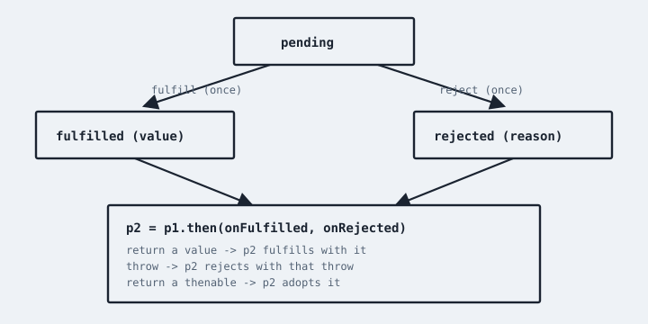

# You Don't Know JS Yet: Sync & Async - 2nd Edition
# Chapter 3: Promises

A promise is an object that represents the eventual completion (or failure) of an async operation, and its resulting value.

Read that again, slowly. A promise is **not** the value. It is not the operation. It is a *placeholder* -- a thenable state machine -- that other code can subscribe to, compose, and return *now*, while the value still lives in *later*.

If callbacks invert control by handing your continuation to someone else, promises restore it: you hold a value that *will* tell you when it's ready, according to rules the language (not the library author) enforces.

Don't skim the state machine. Every "promise weirdness" story I hear in workshops is almost always someone who treated a promise like a callback with extra dots, instead of like a *value with a time dimension*.

## From `printSummary` To A Promise Chain

Chapter 2 left us with a pyramid (or a pile of named functions) that still inverted control. Here's the same program as promises. First, adapters -- the only place we still *need* `new Promise(..)`:

```js
var students = [
    { id: 14, name: "Kyle" },
    { id: 73, name: "Suzy" },
    { id: 112, name: "Frank" },
    { id: 6, name: "Sarah" }
];

function fetchStudent(studentID) {
    return new Promise(function executor(resolve,reject){
        setTimeout(function(){
            var student = students.find(function match(s){
                return s.id == studentID;
            });
            if (student == null) {
                reject(new Error("missing id"));
                return;
            }
            resolve(student);
        }, 50);
    });
}

function fetchEnrollments(studentID) {
    return new Promise(function executor(resolve){
        setTimeout(function(){
            resolve([ "YDKJS", "Functional-Lite" ]);
        }, 50);
    });
}
```

Notice: `fetchStudent` now returns *now* -- a promise -- instead of accepting a callback. The later card is no longer a function you handed away. It's a subscription you'll make with `.then(..)`.

```js
function printSummary(studentID) {
    return fetchStudent(studentID)
        .then(function onStudent(student){
            return fetchEnrollments(student.id)
                .then(function onEnrollments(courses){
                    console.log(
                        student.name + " is taking " +
                        courses.join(", ")
                    );
                    return student;
                });
        })
        .catch(function onFail(err){
            console.error(err);
        });
}

printSummary(73);
```

That still nests! Flatten by returning the next promise from the first handler -- that's the assimilate rule we'll spell out in a moment:

```js
function printSummary(studentID) {
    var student;

    return fetchStudent(studentID)
        .then(function onStudent(s){
            student = s;
            return fetchEnrollments(s.id);
        })
        .then(function onEnrollments(courses){
            console.log(
                student.name + " is taking " +
                courses.join(", ")
            );
            return student;
        })
        .catch(function onFail(err){
            console.error(err);
        });
}
```

`student` is closed over (*Scope & Closures*) because the second `.then` needs a value from the first. That's a little awkward. `async`/`await` (Chapter 5) will make it look like `var student = await fetchStudent(..)`. The mechanics are still this chain. Learn the chain.

`printSummary` itself returns a promise. Callers can wait. That's composition: we didn't invert control *to* `printSummary`; we gave back a value.

## Three States, One Outcome

A promise is always in one of three states:

* **pending** -- not yet settled
* **fulfilled** -- settled successfully, with a value
* **rejected** -- settled with a reason (usually an `Error`)

Settling is **one-way and once**. A fulfilled promise cannot become rejected. A rejected promise cannot become fulfilled. A pending promise can go to either, exactly once. There is no "unsettled again." There is no "fulfilled twice with two values."

Callbacks never had that. `resolve(42); resolve(43); reject("nope")` -- the first settle wins; the rest are no-ops.

```js
p = new Promise(function executor(resolve, reject){
    // typically: one async host call, then:
    resolve(42);
    // or: reject(new Error("fail"));
});
```

The executor runs **synchronously**, as soon as `new Promise(..)` is constructed. That's how the operation gets kicked off. `resolve` / `reject` are the callbacks the executor uses to settle. If the executor throws synchronously, the promise rejects with that throw.

| NOTE: |
| :--- |
| You rarely need `new Promise(..)` if you're already holding promises (from `fetch`, `fs.promises`, etc). The constructor is an *adapter* from callback/host APIs into the promise world. Prefer `Promise.resolve(..)`, `Promise.reject(..)`, and returning promises from `async` functions. Wrapping a promise in another `new Promise` ("the explicit promise construction antipattern") is a smell: you lose errors, doubling, and chaining for no gain. |

## Thenables And `.then(..)`

The observable surface of a promise is `.then(onFulfilled, onRejected)`. Both callbacks are optional. Both are invoked **asynchronously** (as microtasks), even if the promise is already settled.

```js
p.then(
    function onFulfilled(value){
        console.log("got", value);
    },
    function onRejected(reason){
        console.log("failed", reason);
    }
);
```

`.then(..)` **returns a new promise**[^PerformPromiseThen], which settles based on what the handler does:

    

* return a value → the next promise fulfills with that value
* throw → the next promise rejects with that throw
* return a thenable / promise → the next promise *adopts* its state (this is flattening / assimilating)

That last rule is the composition engine. It is why you can return `fetch(..)` from inside `.then(..)` and the chain waits.

```js
fetch("/api/user")
    .then(function onResp(resp){
        if (!resp.ok) throw new Error("not ok");
        return resp.json();      // returns a promise -- flattened
    })
    .then(function onUser(user){
        return user.name;
    })
    .catch(function onFail(err){
        log(err);
    });
```

`.catch(fn)` is `.then(undefined, fn)`. `.finally(fn)` runs on either settlement; its callback receives no value, and unless it throws or returns a rejected promise, the chain's fulfillment/rejection *passes through*.

## Errors Fall Until Caught

A rejection skips `onFulfilled` handlers until it finds an `onRejected` / `.catch(..)`. Same skip as `throw` walking `try` blocks until `catch`. If nothing catches it, the host reports an unhandled rejection[^UnhandledRejection] -- after the current checkpoint, not as a sync throw.

```js
Promise.reject(new Error("oops"))
    .then(function(){ /* skipped */ })
    .then(function(){ /* skipped */ })
    .catch(function(err){
        // lands here
    });
```

Unhandled rejections are as serious as uncaught exceptions. Don't `.then(ok)` without a path for failure somewhere on the chain (or at the `await` call site in Chapter 5). Empty `.catch(() => {})` that swallows errors is the same sin as empty `catch` in sync code.

## Combinators

Independent async work should run concurrently, then join. Sequential `.then` chains when the second call doesn't need the first's value are a performance bug.

```js
// sequential -- usually worse
user = await getUser();
orders = await getOrders();

// concurrent join
[ user, orders ] = await Promise.all([ getUser(), getOrders() ]);
```

(We'll get `await` in Chapter 5; the same join exists as `Promise.all(..).then(..)`.)

The built-in combinators:

* **`Promise.all(iterable)`** -- fulfills with an array of values when *all* fulfill; rejects *immediately* when the first one rejects (other results are discarded, though those operations keep running!).
* **`Promise.allSettled(iterable)`** -- never short-rejects; fulfills with `{ status, value }` / `{ status, reason }` for each input. Use when you want every outcome.
* **`Promise.race(iterable)`** -- settles with whichever input settles first (fulfill *or* reject). Classic timeout pattern:

```js
function withTimeout(p, ms) {
    return Promise.race([
        p,
        new Promise(function(_, reject){
            setTimeout(function(){
                reject(new Error("timeout"));
            }, ms);
        })
    ]);
}
```

| WARNING: |
| :--- |
| `Promise.race` for timeout does **not** cancel the loser. The `fetch` is still in flight unless you pass an `AbortSignal` and abort it in the timeout path. Race is about *which promise you listen to*, not about stopping work. |

Classroom IDs make the `all` vs sequential distinction visceral:

```js
function loadAllSerial(ids) {
    var acc = Promise.resolve([]);
    ids.forEach(function(id){
        acc = acc.then(function(list){
            return fetchStudent(id).then(function(student){
                return list.concat(student.name);
            });
        });
    });
    return acc;
}

function loadAllTogether(ids) {
    return Promise.all(ids.map(fetchStudent))
        .then(function(students){
            return students.map(function(s){ return s.name; });
        });
}
```

`loadAllSerial` is a `.then` waterfall -- Kyle's fulfillment starts Suzy's fetch. `loadAllTogether` starts everyone on the current turn. Same functions as Chapter 5's `async` versions. Learn to see `Promise.all` here so `await Promise.all` later isn't a slogan.

### Combinator Error Semantics

The join is the easy part. The rejection is the part people ship wrong.

**`Promise.all` is fail-fast.** The first rejection rejects the join immediately. The other operations **keep running** -- there is no language-level cancel. You still get one rejection, not an `AggregateError`. If `fetchStudent(14)` fails while 73 is in flight, you must still abort 73 yourself (`AbortSignal`) or accept the wasted work.

```js
Promise.all([
    fetchStudent(73),
    fetchStudent(99)         // rejects
]).catch(function(err){
    // one reason. 73 may still settle later, unheard.
});
```

**`Promise.allSettled` never short-rejects.** You get an array of `{ status: "fulfilled", value }` / `{ status: "rejected", reason }` in input order. Use it when "Kyle failed" must not hide whether Suzy loaded. Inspect every row. A `.then` that only looks at `results[0]` wasted the combinator.

**`Promise.any` is fail-*last*.** The first *fulfillment* wins. Only if *every* input rejects do you get `AggregateError`, whose `.errors` array is those reasons in input order. "Several mirrors, take the first that works" -- until none work, and then you needed all the reasons.

**`Promise.race` is settle-first, either way.** A rejection that arrives before a fulfillment *is* the result. Timeout-via-race is the usual example; it is also how a fast failure poisons a slower success. The loser is not cancelled. Chapter 1's two queues do not change that: both operations are already later cards.

| NOTE: |
| :--- |
| Combinators compose *promises*, not *operations*. `Promise.all` cannot un-`fetch`. If you needed cancellation, you needed `AbortSignal` at the `fetch` call, not a different combinator. |

* **`Promise.resolve(value)`** -- if `value` is a promise, returns it (mostly); if thenable, assimilates; otherwise returns a fulfilled promise. Use to lift a maybe-thenable into a real promise.
* **`Promise.reject(reason)`** -- a rejected promise.
* **`Promise.try(fn)`** (ES2025) -- runs `fn` synchronously, fulfills with its return, rejects if it throws *or* if it returns a rejected promise. The missing link for wrapping mixed sync/async functions without `new Promise`.
* **`Promise.withResolvers()`** (ES2024) -- `{ promise, resolve, reject }` when you need the settle functions *outside* an executor (deferreds, without the old anti-pattern of leaking them ad hoc).

```js
var { promise, resolve, reject } = Promise.withResolvers();

button.addEventListener("click", function(){
    resolve("clicked");
}, { once: true });
```

## Thenables That Aren't Promises

A *thenable* is any object with a `.then` method. Promise resolution *adopts* thenables by enqueueing a **PromiseResolveThenableJob**[^PromiseResolveThenableJob]. Libraries interoperated that way before `Promise` was in the language. Foreign futures still plug in that way.

It's also a footgun: if you accidentally have an object with a `then` property that is a function (malicious JSON, a weird class), `Promise.resolve(obj)` will treat it as a thenable and call `then`. Don't put a function named `then` on ordinary data objects.

The job is not `obj.then()` on this turn. Resolution enqueues work; `then` runs as a job, like every other reaction. A thenable that calls its resolve callback synchronously still cannot re-enter your `Promise.resolve` line. Zalgo stays dead. A thenable that never calls either callback is a pending-forever leak -- same as a `fetch` you forgot to join.

Appendix A has the "thenable worm" classroom DTO if you want to see a JSON payload take over a chain. The spec name is enough for this chapter: **thenable** is a protocol, not a brand.

## Sync-Looking Lies

```js
p = Promise.resolve(42);

p.then(function(){
    console.log("then");
});

console.log("after");
```

```
after
then
```

Even an already-fulfilled promise invokes `.then` callbacks later (microtask). That is *by design*: it kills Zalgo. You can always write the rest of the current function assuming `.then` has not run yet.

`await` on an already-resolved promise also defers (a microtask at least). "It's already done" never means "the next line after `.then` / `await` has run."

## Cancellation Is Not A Promise State

Promises have no cancelled state. A cancelled operation should:

1. **stop doing work** (abort the fetch, clear the timer), and
2. **reject** (often with `AbortError`) or, if you prefer "no result is not an error," leave the promise pending forever -- which I generally *don't* prefer, because pending-forever promises hide leaks.

```js
controller = new AbortController();

p = fetch("/api/big", { signal: controller.signal });

controller.abort();
// p rejects with DOMException / AbortError
```

`AbortSignal.timeout(ms)` and `AbortSignal.any([..])` compose cancellation the way `Promise.race` / `any` compose settlement -- for the *work*, not just the listener.

Timeout-via-`Promise.race` still leaves the `fetch` in flight. Timeout-via-`AbortSignal.timeout` can be passed *into* `fetch`, so the host tears the connection down. `AbortSignal.any([ userSignal, AbortSignal.timeout(8000) ])` is "user cancel *or* eight seconds," one signal, one `fetch` option.

```js
function fetchStudent(id, signal) {
    var timed = AbortSignal.any([
        signal,
        AbortSignal.timeout(8000)
    ]);
    return fetch("/api/students/" + id, { signal: timed })
        .then(function onResp(resp){
            if (!resp.ok) throw new Error("not ok");
            return resp.json();
        });
}
```

The promise still has two states after abort: it **rejects** (`AbortError`). There is no third "cancelled" box on the figure. If you `catch` and swallow `AbortError` because the user navigated away, say that in the handler. A pending-forever promise after abort is a leak that looks like patience.

`Promise.all` does not take a signal. You pass the same `timed` into every `fetchStudent`, then `all` rejects on the first abort *and* the other fetches stop because they share the signal. Combinator first; signal through the leaves. Reversing that (race the join, forget the leaves) is how you "cancel" a spinner and keep downloading.

## Promises Are Values

The shift from callbacks to promises is a shift from *continuations you pass in* to *values you pass around*. You can store a promise, return it, put it in an array, race it, share it with two consumers (both `.then`s get the same fulfillment -- promises **multicast** their settlement).

```js
configPromise = loadConfig();     // kick off once

// many callers, one load:
configPromise.then(startApp);
configPromise.then(wireAnalytics);
```

That's memoization of async work for free, as long as you hold the promise, not the factory.

```js
var suzyPromise = fetchStudent(73);

suzyPromise.then(function log(s){
    console.log("first", s.name);
});
suzyPromise.then(function logAgain(s){
    console.log("second", s.name);
});
```

Both handlers run (as separate microtasks) with the same fulfillment. You did not kick off two networks. That's a property callbacks do not have unless you build a thunk *and* a cache *and* a subscriber list yourself.

### See The Chain

Flattened `printSummary` is the program I want you to be able to *see*, not just paste.

```js
return fetchStudent(studentID)
    .then(function onStudent(s){
        student = s;
        return fetchEnrollments(s.id);
    })
    .then(function onEnrollments(courses){
        console.log(
            student.name + " is taking " +
            courses.join(", ")
        );
        return student;
    })
    .catch(function onFail(err){
        console.error(err);
    });
```

1. `fetchStudent(73)` returns *now*, a pending promise. The executor has already scheduled the timeout.
2. `.then(onStudent)` returns *now*, a second promise -- still pending. `onStudent` has **not** run. Zalgo is dead: you can write code after `printSummary(73)` and know `onStudent` hasn't happened.
3. `.then(onEnrollments)` returns *now*, a third promise. `.catch(onFail)` a fourth. `printSummary` returns that last one *now*.
4. *Later,* student promise fulfills. A **job** runs `onStudent`. It assigns `student` (live binding -- Book 2) and returns the enrollments promise. The second promise *adopts* that returned promise (assimilate).
5. *Later still,* enrollments fulfill. A job runs `onEnrollments`. `console.log` is *now* on that job. The third promise fulfills with `student`.
6. If anything along the way rejected, jobs skip until `onFail`. The returned promise fulfills with `undefined` (we didn't rethrow). Callers who `await printSummary` get `undefined` on failure unless you `throw err` in `onFail`. Pick that. Don't inherit it.

The nested version from the start of the chapter is the same jobs with worse plumbing. The `async`/`await` version in Chapter 5 is the same jobs with the compiler writing this chain. If you cannot walk *this*, `await` will be a pause button in your head, and you will serialize `fetchA` and `fetchB` without noticing.

### `finally` Passes Through

```js
fetchStudent(73)
    .finally(function onSettle(){
        console.log("attempted");
    })
    .then(function onStudent(student){
        console.log(student.name);
    });
```

`onSettle` runs on fulfill *or* reject. It does not receive Suzy. The fulfillment still flows to `onStudent` unless `onSettle` **throws** or **returns a rejected promise** -- in which case *that* rejection wins. A plain `return "dummy"` from `Promise#finally` is **ignored**; you still get Suzy. That is *not* the same as `try..finally`, where `return` in `finally` overrides the `try` value. Don't throw from `finally` "to be safe." You just ate Suzy.

### The Explicit Promise Construction Antipattern

If you already have a promise, wrapping it is not "more promise." It's a bug nursery:

```js
// don't
return new Promise(function(resolve,reject){
    fetchStudent(id).then(resolve,reject);
});

// do
return fetchStudent(id);
```

The wrapper can drop rejections if you write `.then(resolve)` without `reject`, can double-resolve if you also call `resolve` yourself, and tells the next reader you don't trust `.then`'s return value. Trust it.

Take the Chapter 2 hostile `fetch` (called twice, called with an error after success) and wrap it in `new Promise` *once*, with `onceLater` or a `called` flag in the executor. That wrapper is the adapter. Above it, speak only promises.

Chapter 4 adds another kind of value-that-represents-a-sequence: iterators and generators. Combined with promises, they are the engine under `async`/`await`. Even if you only ever write `async function`, you should know what's moving. Don't skip Chapter 4 because the syntax looks old. `await` is that chapter wearing nicer clothes.

[^PerformPromiseThen]: "27.2.5.4.1 PerformPromiseThen ( promise, onFulfilled, onRejected [ , resultCapability ] )", ECMAScript 2025 Language Specification; https://262.ecma-international.org/16.0/#sec-performpromisethen ; Accessed September 2026

[^PromiseResolveThenableJob]: "27.2.2.2 NewPromiseResolveThenableJob ( promiseToResolve, thenable, then )", ECMAScript 2025 Language Specification; https://262.ecma-international.org/16.0/#sec-newpromiseresolvethenablejob ; Accessed September 2026

[^UnhandledRejection]: "8.1.7.3 Event loop processing model" / "notify about rejected promises", HTML Living Standard; https://html.spec.whatwg.org/multipage/webappapis.html#unhandled-promise-rejections ; Accessed September 2026
